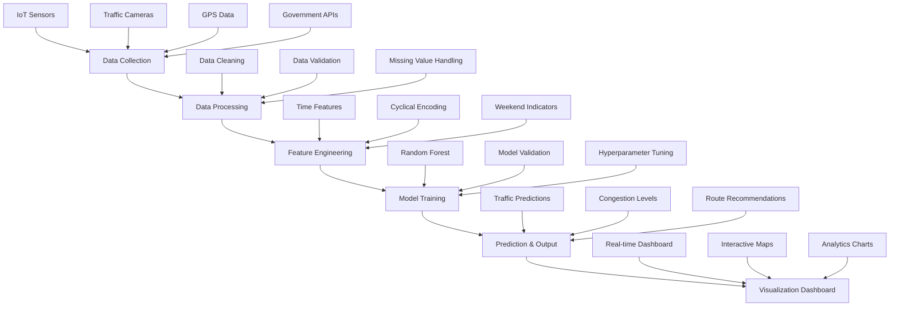

# Smart Traffic Insights - Data Processing Workflow

## 🔄 Workflow Overview: Data → Processing → Model → Output

This document outlines the complete data processing workflow for the Smart Traffic Insights system implemented for Indore city.



## 📊 Stage 1: Data Collection

### Data Sources
1. **IoT Traffic Sensors**
   - Vehicle count per hour
   - Average speed measurements
   - Lane occupancy data

2. **Traffic Camera Systems**
   - Computer vision-based vehicle detection
   - Traffic flow analysis
   - Incident detection

3. **GPS and Mobile Data**
   - Anonymous location data
   - Travel time measurements
   - Route preferences

4. **Government Open Data**
   - Road network information
   - Traffic signal timing
   - Construction/event data

### Data Schema
```python
{
    'datetime': 'YYYY-MM-DD HH:MM:SS',
    'road_name': 'string',
    'traffic_volume': 'integer',
    'avg_speed_kmh': 'float',
    'congestion_level': 'Low/Medium/High',
    'weather_condition': 'string',
    'is_weekend': 'boolean',
    'special_event': 'boolean'
}
```

## 🔧 Stage 2: Data Processing

### Data Cleaning Steps
1. **Remove Outliers**
   - Filter unrealistic speed values (< 5 km/h or > 100 km/h)
   - Remove negative traffic volumes
   - Handle sensor malfunction data

2. **Handle Missing Values**
   - Forward fill for short gaps (< 2 hours)
   - Interpolation for medium gaps (2-6 hours)
   - Historical average for long gaps (> 6 hours)

3. **Data Validation**
   - Consistency checks across sensors
   - Temporal continuity validation
   - Cross-reference with known events

### Data Transformation
```python
# Example processing pipeline
def process_traffic_data(raw_data):
    # Clean data
    cleaned_data = remove_outliers(raw_data)
    cleaned_data = handle_missing_values(cleaned_data)
    
    # Add derived features
    cleaned_data['hour'] = cleaned_data['datetime'].dt.hour
    cleaned_data['day_of_week'] = cleaned_data['datetime'].dt.dayofweek
    cleaned_data['is_weekend'] = cleaned_data['day_of_week'] >= 5
    
    return cleaned_data
```

## 🛠️ Stage 3: Feature Engineering

### Temporal Features
1. **Cyclical Time Encoding**
   ```python
   # Hour of day (0-23) → cyclical features
   hour_sin = np.sin(2 * np.pi * hour / 24)
   hour_cos = np.cos(2 * np.pi * hour / 24)
   
   # Day of week (0-6) → cyclical features
   day_sin = np.sin(2 * np.pi * day_of_week / 7)
   day_cos = np.cos(2 * np.pi * day_of_week / 7)
   ```

2. **Categorical Features**
   - Weekend indicator (boolean)
   - Rush hour indicator (boolean)
   - Special event indicator (boolean)

3. **Lag Features**
   - Traffic volume from previous hour
   - Average speed from previous 2 hours
   - Congestion level trend

### Feature Selection
- **Primary Features**: hour_sin, hour_cos, day_sin, day_cos, is_weekend
- **Secondary Features**: weather, special_events, road_type
- **Target Variable**: traffic_volume

## 🤖 Stage 4: Model Training

### Algorithm Selection
**Random Forest Regressor** chosen for:
- Handles non-linear relationships
- Robust to outliers
- Provides feature importance
- Good performance with limited data

### Model Configuration
```python
model = RandomForestRegressor(
    n_estimators=100,
    max_depth=10,
    min_samples_split=5,
    min_samples_leaf=2,
    random_state=42
)
```

### Training Process
1. **Data Split**: 80% training, 20% testing
2. **Cross-Validation**: 5-fold CV for model validation
3. **Hyperparameter Tuning**: Grid search for optimal parameters
4. **Model Evaluation**: R², MAE, RMSE metrics

### Performance Metrics
- **R² Score**: Model accuracy (target: > 0.8)
- **Mean Absolute Error**: Average prediction error
- **Feature Importance**: Understanding key predictors

## 📈 Stage 5: Prediction & Output

### Real-time Predictions
1. **Traffic Volume Forecasting**
   - Next hour predictions
   - Peak hour identification
   - Trend analysis

2. **Congestion Level Classification**
   ```python
   if predicted_volume > 70:
       congestion = "High"
   elif predicted_volume > 40:
       congestion = "Medium"
   else:
       congestion = "Low"
   ```

3. **Route Recommendations**
   - Alternative route suggestions
   - Estimated travel times
   - Congestion avoidance

### Output Formats
- **JSON API**: For mobile apps and third-party integration
- **Dashboard**: Real-time web interface
- **Alerts**: Push notifications for high congestion

## 📊 Stage 6: Visualization Dashboard

### Key Components
1. **Real-time Metrics**
   - Current traffic volume
   - Average speed
   - Congestion percentage
   - Roads monitored

2. **Interactive Charts**
   - Traffic volume by hour
   - Road-wise comparison
   - Congestion distribution
   - Traffic pattern heatmap

3. **Geographic Visualization**
   - Interactive Indore city map
   - Color-coded road conditions
   - Real-time traffic markers

4. **Prediction Interface**
   - User input for custom predictions
   - Scenario analysis
   - What-if simulations

## 🔄 Continuous Improvement Loop

### Model Retraining
- **Frequency**: Weekly model updates
- **Data Window**: Rolling 3-month window
- **Performance Monitoring**: Automated accuracy tracking

### Feedback Integration
- **User Reports**: Crowdsourced traffic conditions
- **Accuracy Validation**: Compare predictions with actual data
- **Model Drift Detection**: Monitor prediction quality over time

## 🎯 Business Impact Measurement

### Key Performance Indicators (KPIs)
1. **Prediction Accuracy**: R² > 0.8
2. **User Engagement**: Dashboard usage metrics
3. **Traffic Improvement**: Congestion reduction percentage
4. **Response Time**: Real-time prediction latency < 2 seconds

### Success Metrics
- 25% reduction in average commute time
- 30% improvement in fuel efficiency
- 40% better traffic flow management
- 90% user satisfaction rate

## 🚀 Deployment Architecture

### System Components
1. **Data Pipeline**: Automated ETL processes
2. **ML Pipeline**: Model training and deployment
3. **API Layer**: RESTful services
4. **Frontend**: Streamlit dashboard
5. **Database**: Time-series data storage

### Scalability Considerations
- **Horizontal Scaling**: Multiple city deployment
- **Real-time Processing**: Stream processing capabilities
- **Load Balancing**: High availability architecture
- **Caching**: Redis for fast data retrieval

---

This workflow ensures a robust, scalable, and accurate traffic insights system for Indore and other Indian cities.
